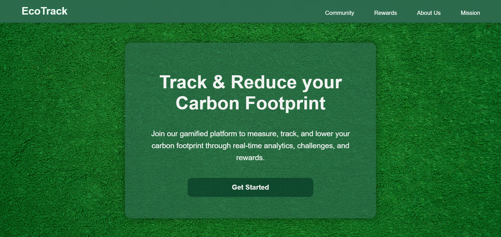
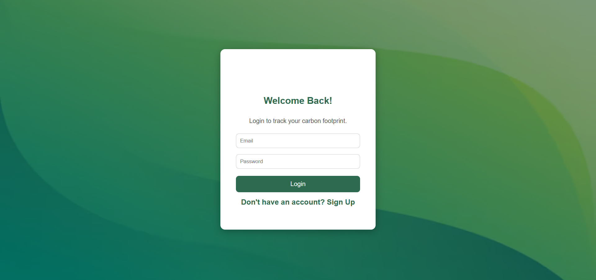
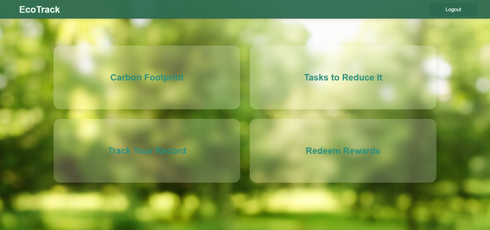
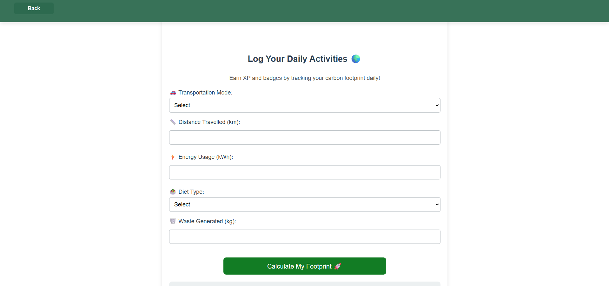
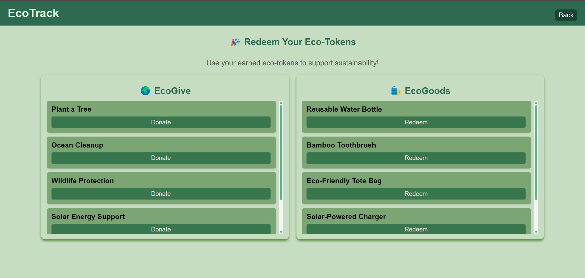
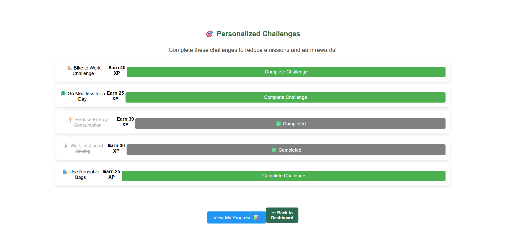

# Gamified Carbon Footprint Calculator
[](https://reactjs.org/)
[](https://firebase.google.com/)
[](https://firebase.google.com/docs/auth)
[](https://developer.mozilla.org/en-US/docs/Web/CSS)


This project is a web-based application designed to help users calculate their carbon footprint and incentivize eco-friendly behavior through gamification. The platform integrates Firebase for authentication and data storage, providing a seamless user experience.

## Features
- Carbon footprint calculation based on user activities.
- Gamified challenges to promote sustainable practices.
- Reward system that allows users to earn and redeem points.
- Secure authentication using Firebase.
- Responsive and interactive user interface built with React.js.

## Screenshots

### Landing Page


### Authentication


### Dashboard


### Activity Tracking


### Rewards System


### Challenges


## Technology Stack
- **Frontend:** React.js (including animations)
- **Backend:** Firebase (Authentication & Firestore)
- **Hosting:** Firebase Hosting

## Getting Started

### Clone the Repository
```sh
git clone https://github.com/your-username/carbon-footprint-calculator.git
cd carbon-footprint-calculator
```

### Install Dependencies
```sh
npm install
```

### Configure Environment Variables
Create a `.env` file in the root directory and add the following:
```
REACT_APP_FIREBASE_API_KEY=your_api_key_here
REACT_APP_FIREBASE_AUTH_DOMAIN=your_auth_domain_here
REACT_APP_FIREBASE_PROJECT_ID=your_project_id
REACT_APP_FIREBASE_STORAGE_BUCKET=your_storage_bucket
REACT_APP_FIREBASE_MESSAGING_SENDER_ID=your_messaging_sender_id
REACT_APP_FIREBASE_APP_ID=your_app_id
```

### Run the Development Server
```sh
npm start
```
The application will be available at `http://localhost:3000/`.

## Deployment Using Firebase Hosting
1. Install Firebase CLI:
   ```sh
   npm install -g firebase-tools
   ```
2. Log in to Firebase:
   ```sh
   firebase login
   ```
3. Initialize Firebase Hosting:
   ```sh
   firebase init hosting
   ```
4. Build the project:
   ```sh
   npm run build
   ```
5. Deploy the application:
   ```sh
   firebase deploy
   ```
Upon successful deployment, Firebase will generate a live URL for the application.

## Contributors
- [Prarambhi Kharose](https://github.com/Prarambhi)
- [Vishnu Priya Sahu](https://github.com/Vishnu-Priya-Sahu)

## License
This project is licensed under the [MIT License](LICENSE).
